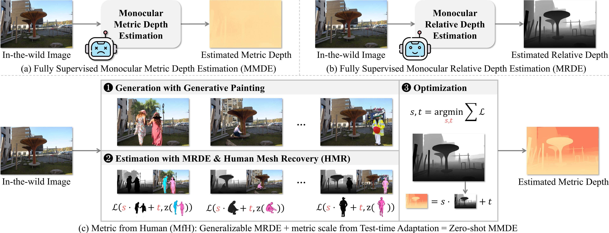

# Metric from Human: Zero-shot Monocular Metric Depth Estimation via Test-time Adaptation

---



> [**Metric from Human: Zero-shot Monocular Metric Depth Estimation via Test-time Adaptation**](https://openreview.net/pdf?id=GA8TVtxudf),  
> Yizhou Zhao, Hengwei Bian, Kaihua Chen, Pengliang Ji, Liao Qu, Shao-yu Lin, Weichen Yu, Haoran Li, Hao Chen, Jun Shen, Bhiksha Raj, Min Xu,  
> NeurIPS 2024

## Installation

We tested our code using:

- Ubuntu 22.04
- CUDA 11.8
- 1 x Nvidia A100 80G

```shell
git clone https://github.com/Skaldak/MfH.git --recursive
cd MfH
conda env create --file environment.yml
```

## Getting Started

We provide in-the-wild images for quick start. Download and unzip them:

```shell
mkdir data
cd data
wget https://github.com/Skaldak/MfH/releases/download/datasets/wild.zip
unzip wild.zip
rm wild.zip
cd ..
```

To infer for in-the-wild images:

```shell
python run.py --input_path data/wild --output_path logs/wild --visualize 1
```

## Evaluation

### Data Preparation

For evaluation, please download datasets from their origins:

- [NYU Depth V2](https://cs.nyu.edu/~silberman/datasets/nyu_depth_v2.html)
- [KITTI](https://www.cvlibs.net/datasets/kitti/eval_depth.php?benchmark=depth_prediction)
- [iBims-1](https://www.asg.ed.tum.de/lmf/ibims1/)
- [DIODE](https://diode-dataset.org/)
- [ETH3D](https://www.eth3d.net/datasets)

We refer readers to [BTS](https://github.com/cleinc/bts?tab=readme-ov-file#preparation-for-all-implementations) for preparing NYU Depth V2 and KITTI, and to [Marigold](https://github.com/prs-eth/Marigold?tab=readme-ov-file#-evaluation-on-test-datasets-) for preparing DIODE and ETH3D. After downloading, organize them as follows under the `./data` folder:

```
./data/
├── diode
│   └── val
│       └── indoors
├── eth3d
│   ├── eth3d_filename_list.txt
│   └── rgb
│       ├── courtyard
│       ├── ...
│       └── terrains
├── ibims1_core_raw
│   ├── calib
│   ├── depth
│   ├── edges
│   ├── imagelist.txt
│   ├── mask_floor
│   ├── mask_invalid
│   ├── mask_table
│   ├── mask_transp
│   ├── mask_wall
│   ├── readme.txt
│   └── rgb
├── kitti
│   ├── gts
│   │   ├── 2011_09_26_drive_0001_sync
│   │   ├── ...
│   │   └── 2011_10_03_drive_0047_sync
│   └── raw
│       ├── 2011_09_26
│       ├── ...
│       └── 2011_10_03
└── nyu_depth_v2
    └── official_splits
        └── test
```

### Pre-trained Models

Download the pre-trained [Depth-Anything](https://github.com/LiheYoung/Depth-Anything) checkpoint: 

```shell
mkdir checkpoints
cd checkpoints
wget https://huggingface.co/spaces/LiheYoung/Depth-Anything/resolve/main/checkpoints/depth_anything_vitl14.pth
cd ..
```

The pre-trained [4D-Humans](https://github.com/shubham-goel/4D-Humans) and [Stable Diffusion v2 Inpainting](https://huggingface.co/stabilityai/stable-diffusion-2-inpainting) will be downloaded automatically during inference.

### Evaluating with A Single GPU

```shell
# NYU Depth V2
python run.py -d nyu --output_path outputs/nyu

# KITTI
python run.py -d kitti --output_path outputs/kitti

# iBims-1
python run.py -d ibims --output_path outputs/ibims

# DIODE Indoor
python run.py -d diode_indoor --output_path outputs/diode

# ETH3D
python run.py -d eth3d --output_path outputs/eth3d
```

## Acknowledgements

Parts of the code are taken or adapted from the following repos:

- [Depth-Anything](https://github.com/LiheYoung/Depth-Anything)
- [ZoeDepth](https://github.com/isl-org/ZoeDepth)
- [4D-Humans](https://github.com/shubham-goel/4D-Humans)

## Citing MfH

If you find this project helpful for your research, please consider citing the following BibTeX entry:

```
@inproceedings{zhao2024metric,
  title={Metric from Human: Zero-shot Monocular Metric Depth Estimation via Test-time Adaptation},
  author={Zhao, Yizhou and Bian, Hengwei and Chen, Kaihua and Ji, Pengliang and Qu, Liao and Lin, Shao-yu and Yu, Weichen and Li, Haoran and Chen, Hao and Shen, Jun and others},
  booktitle={The Thirty-eighth Annual Conference on Neural Information Processing Systems},
  year={2024}
}
```

